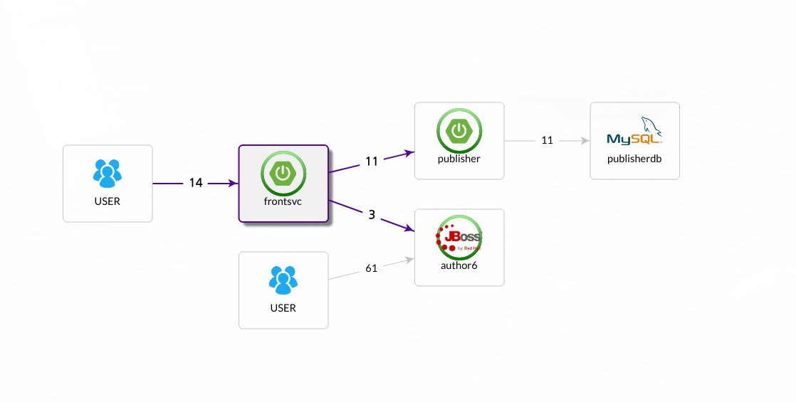

# **open-apm**
Open source APM solutions HOW-TOs

# Overview
This repo documents installation & configuration steps to utilize a number of open source APM solutions.  

The goal is to eventually cover the following solutions:
* [Naver Pinpoint](https://naver.github.io/pinpoint/index.html)
* [Apache Skywalking](http://skywalking.apache.org/)
* [StageMonitor](http://www.stagemonitor.org/)
* [Elastic APM](https://www.elastic.co/solutions/apm)

The following diagram shows a topology layout of the reference application (as shown by pinpoint web), showing a *__front__* service API implemented using Spring Boot that invokes an *__author__* service, running on Red Hat EAP 6.4, as well as a *__publisher__* service that's also implemented using Spring Boot. The publisher service interacts with a MySQL database to retrieve its data.

## Steps to build the jars
* Open the publisher folder (I'm using VS Code)
* Build the target jar (./mvnw package)
* The jar should be created in the target folder
* Repeat for the FrontEndSvc folder
* Repeat for the author_ee6/author-svc folder (this should generate author-svc.war)

## Setting up MySQL publisherdb instance using Docker
>sudo docker run --name mysqldb -e MYSQL_ROOT_PASSWORD=secret -e MYSQL_DATABASE=publisherdb -d -p 3306:3306 mysql 

  
## Follow the different links for APM solution specific steps
* [Naver Pinpoint](pinpoint.md)  
* [Apache Skywalking](skywalking.md)

## URLs for testing
To hit the publisher directly:  
> curl http://localhost:8090/publishers  
 > curl http://localhost:8090/publishers/Wrox  

To hit the publisher service and inject a 100ms delay  
> curl http://localhost:8090/publishers/Wrox?delay=100  

To hit the author service directly and inject a 100ms delay: 
> curl localhost:8180/author-svc/rest/author/Sam?delay=100

To hit the front service and invoke the publisher to obtain a publisher data:  
> curl localhost:8070/front/publisher/Wrox

To hit the front service and invoke the author service
> curl localhost:8070/front/author/Joe

To create a loop that continuously hit the publisher service, inserting 100ms delay at the front service, and 500ms at the publisher service:  
  > while true; do curl "localhost:8070/front/publisher/Packt?delay=100&backendDelay=500"; echo; sleep 1; done

