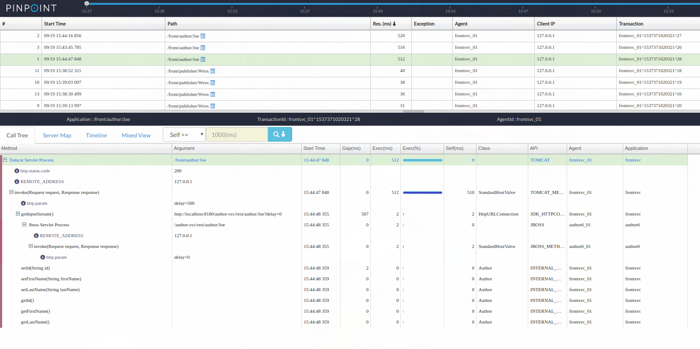

# Pinpoint 1.7.3

## Findings
* Does not support Java 9 and above (need to use Pinpoint v1.8.0 and above)

## Set up HBase for Naver Pinpoint
* Download and extract HBase 1.4.6
* Set JAVA_HOME, make sure it is pointing to a Java 8 JRE!
* Configure hbase-site.xml:
   > \<configuration\>  
   \<property\>  
      \<name\>hbase.rootdir\</name\>  
      \<value\>file:///home/andre/hbase/root\</value\>  
  \</property\>  
  \<property\>  
    \<name\>hbase.zookeeper.property.dataDir\</name\>  
    \<value\>/home/andre/hbase/zookeeper\</value\>  
  \</property\>
* Start hbase (bin/start-hbase.sh)
* Generate the pinpoint tables 
  > bin/hbase shell /home/andre/pinpoint/pinpoint/hbase/scripts/hbase-create.hbase 
* Validate that the pinpoint tables are created

## Configure Pinpoint collector and web UI
* Download v1.7.3 of pinpoint collector and web UI war files
* Download Apache Tomcat 8.5.33
* Extract the Apache Tomcat files to ~/tomcat/pinpoint_web
* Remove everything under ~/tomcat/pinpoint_web/webapps
* Copy pinpoint web UI war file to webapps, rename it as root.war
* Start Tomcat (bin/startup.sh)
* Extract another copy of the Apache Tomcat files to ~/tomcat/pinpoint_collector
* Remove everything under ~/tomcat/pinpoint_collector/webapps
* Copy pinpoint collect war file to webapps, rename it as root.war
* Modify ~/tomcat/pinpoint_collector/conf/server.xml and change all the port number to avoid conflict with the other Tomcat instance
* Start Tomcat

## Configure the publisher service
* Download v1.7.3 of pinpoint agent
* Modify pinpoint.config file 
* Start the publisher service, make sure to use **Java 8 JRE**
  > $JAVA_HOME/bin/java -javaagent:./pinpoint-bootstrap-1.7.3.jar -Dpinpoint.agentId=publisher_01 -Dpinpoint.applicationName=publisher -jar ./publisher-0.0.1-SNAPSHOT.jar

## Configure the front service
* Extract another copy of pinpoint agent 1.7.3
* Modify pinpoint.config file
* Start the front service, use Java 8
  > $JAVA_HOME/bin/java -javaagent:./pinpoint-bootstrap-1.7.3.jar -Dpinpoint.agentId=frontsvc_01 -Dpinpoint.applicationName=frontsvc -jar FrontEndSvc-0.0.1-SNAPSHOT.jar 

## Configure the author service
* Extract another copy of pinpoint agent 1.7.3 (e.g. to /home/andre/author folder)
* Modify pinpoint.config file (e.g. /home/andre/author/pinpoint.config)
* Download and extract EAP 6.4 image
* Copy author-svc.war to <EAP 6.4 home>/standalone/deployments
* Modify <EAP 6.4 home>/standalone/configuration/standalone.xml to add a port offset of 100:
  > \<socket-binding-group name="standard-sockets" default-interface="public" port-offset="${jboss.socket.binding.port-offset:**100**}"\>
* Modify <EAP 6.4 home>/bin/standalone.conf to add additional JVM arguments:
  > if [ "x\$JAVA_OPTS" = "x" ]; then  
   JAVA_OPTS="-Xms1303m -Xmx1303m -XX:MaxPermSize=256m -Djava.net.preferIPv4Stack=true"  
   JAVA_OPTS="\$JAVA_OPTS -Djava.awt.headless=true"  
   JAVA_OPTS="\$JAVA_OPTS -Djboss.modules.policy-permissions=true"  
   JAVA_OPTS="\$JAVA_OPTS -Djboss.modules.system.pkgs=org.jboss.byteman,org.jboss.logmanager,  com.navercorp.pinpoint.bootstrap,com.navercorp.pinpoint.common,com.navercorp.pinpoint.exception"  
   JAVA_OPTS="\$JAVA_OPTS -Djava.util.logging.manager=org.jboss.logmanager.LogManager"  
   JAVA_OPTS="\$JAVA_OPTS -Xbootclasspath/p:/home/andre/wildfly-12.0.0.Final/modules/system/layers/base/org/jboss/logmanager/main/jboss-logmanager-2.0.9.Final.jar"  
   JAVA_OPTS="\$JAVA_OPTS -javaagent:/home/andre/author/pinpoint-bootstrap-1.7.3.jar"  
   JAVA_OPTS="\$JAVA_OPTS -Dpinpoint.applicationName=author6"  
   JAVA_OPTS="\$JAVA_OPTS -Dpinpoint.agentId=author6_01"  
* Start the author service, use Java 8
  > <EAP 6.4 home>/bin/standalone.sh

## Screenshots

Example trace output
