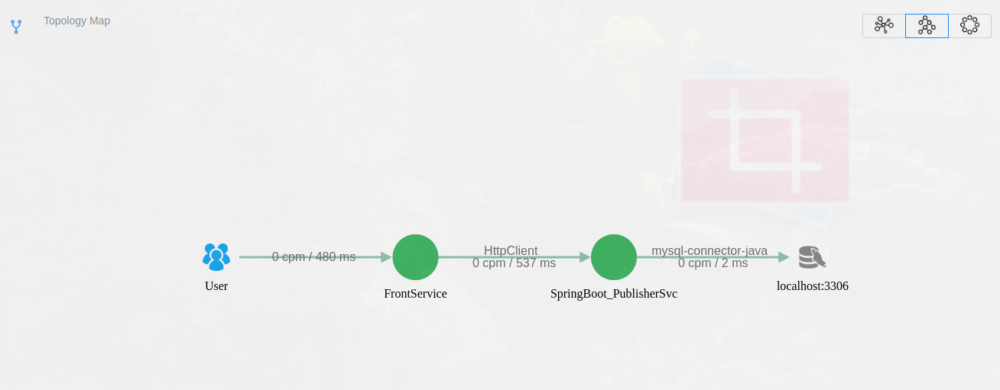
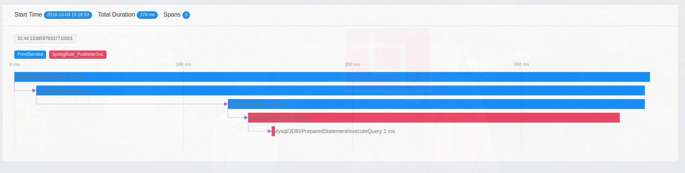

# Apache Skywalking 5.0.0 beta2

## Findings
* No support for JBoss EAP 6.4 (agent successfully registered the application, but no trace data collected)
* No support for JAX-RS client builder (Jersey)
* Support REST call made using Apache HttpClient
* Support REST call made using Spring @RestTemplate
  
## Set up Elastic Search as the backend
* Download and install Elastic Search 6.4.0
* Modify /etc/elasticsearch/elasticseach.yml :
    >  cluster.name: CollectorDBCluster  
    node.name: node-1  
    thread_pool.bulk.queue_size: 1000  
* Start elastic search (sudo systemctl start elasticsearch)

## Set up Skywalking server
* Download and extract Apache Skywalking tar / zip file
* Modify \<skywalking home\>/config/application.yml:
  >  storage:  
       elasticsearch:  
         clusterName: CollectorDBCluster  
         clusterTransportSniffer: true  
         clusterNodes: localhost:9300  
         indexShardsNumber: 2  
         ...  
* Start the collector and webapp processes: bin/startup.sh

## Configure the publisher service
* Extract the skywalking agent folder to a new publisher folder
* Copy the publisher-0.0.1-SNAPSHOT.jar to the publisher folder
* Modify config/agent.config to provide unique identity (agent.application_code)
* Start the publisher service, make sure to use **Java 8 JRE**
  > $JAVA_HOME/bin/java -javaagent:./agent/skywalking-agent.jar -jar ./publisher-0.0.1-SNAPSHOT.jar

## Configure the front service
* Extract the skywalking agent folder to a new frontservice folder
* Copy the FrontEndSvc-0.0.1-SNAPSHOT.jar to the frontservice folder
* Modify config/agent.config to provide unique identity (agent.application_code)
* Start the front service, use Java 8
  > $JAVA_HOME/bin/java -javaagent:./agent/skywalking-agent.jar -jar FrontEndSvc-0.0.1-SNAPSHOT.jar 

## Screenshots

Example topology view, calls to author service (EAP 6.4) are not detected

Example trace output
